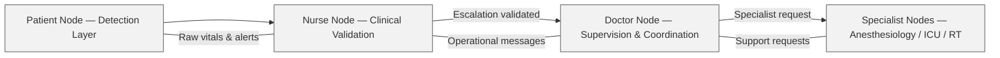

# 🩺 CareLink Clinical Flow — v0.3
### *Human‑centered escalation model for safe and realistic ward workflows.*

CareLink follows a clinical flow inspired by real hospital practice.  
The system never bypasses the nurse, who remains the primary decision‑maker for bedside monitoring and escalation.

This document describes how alerts, trends, and decisions move through the CareLink ecosystem.

---

# 1. 🌡️ Patient Node — Detection Layer
**Role:** Continuous monitoring and first‑level anomaly detection.

The Patient Node collects raw vitals and performs lightweight edge analysis:

- Heart Rate (BPM)
- SpO₂
- Body Temperature
- Simplified Shock Index (sSI)
- Infection Alert logic
- Basic trend deviation detection

**Important:**  
The Patient Node does *not* escalate directly to physicians.  
It only communicates with the Nurse Node.

---

# 2. 👩‍⚕️ Nurse Node — Clinical Validation Layer
**Role:** The nurse is the first human filter and the core of the decision process.

The Nurse Node receives:

- raw alerts  
- trend deviations  
- combined anomalies  
- patient‑specific warnings  

The nurse evaluates the alert based on:

- patient condition  
- clinical context  
- recent therapy  
- known comorbidities  
- real‑time observation  

### The nurse can:
- acknowledge the alert  
- silence or monitor the situation  
- request additional checks  
- **escalate to the Doctor Node** when appropriate  

### The nurse cannot be bypassed.
No alert reaches the physician without nurse validation.

This preserves clinical hierarchy and avoids unnecessary cognitive load on doctors.

---

# 3. 🩺 Doctor Node — Supervisory & Coordination Layer (v0.5+)
**Role:** Receives only validated alerts and nurse‑initiated requests.

The Doctor Node is a fixed workstation designed for:

- viewing validated alerts  
- reviewing patient trends  
- receiving nurse messages  
- coordinating clinical actions  
- requesting specialist support  

### The Doctor Node receives:
- nurse‑validated escalations  
- trend deterioration confirmed by the nurse  
- operational messages (e.g., “Therapy updated for Bed 3”)  

### The Doctor Node does *not* receive:
- raw alerts  
- unfiltered anomalies  
- direct messages from Patient Nodes  

This ensures physicians focus only on clinically relevant events.

---

# 4. 🧑‍⚕️ Specialist Nodes — Optional Future Expansion
**Role:** Department‑level support (anesthesiology, resuscitation, respiratory therapy).

Triggered only by the Doctor Node or by explicit nurse request.

Examples:

- “Request anesthesiology support”
- “Notify resuscitation team”
- “Respiratory therapy consult needed”

These nodes are optional and modular, allowing hospitals to customize CareLink to their workflow.

---

# 5. 🔄 Escalation Flow Summary

```

Patient Node  →  Nurse Node  →  Doctor Node  →  Specialist Nodes (optional)
|               |               |
detection       validation       supervision

```

### Key Principles:
- **Nurse-first model:** No direct escalation to physicians.  
- **Human-centered:** Technology supports, never replaces.  
- **Context-aware:** Nurses interpret alerts based on real patient conditions.  
- **Scalable:** Specialist integration is optional and modular.  
- **Safe:** Reduces alarm fatigue and preserves clinical hierarchy.

---

# 6. 🧠 Why This Model Matters

CareLink is designed to respect real hospital dynamics:

- Nurses are the backbone of bedside monitoring.  
- Physicians must receive only meaningful, validated information.  
- Specialists intervene only when necessary.  
- Technology should reduce stress, not add noise.  

This flow ensures CareLink remains a **silent ally**, not a disruptive system.

---

## 7. 📊 Mermaid Diagram — Clinical Escalation Flow



# ⚠️ Disclaimer
CareLink is a technical and educational prototype inspired by clinical workflows.  
It is **not** a certified medical device and must not be used for life‑critical monitoring.
